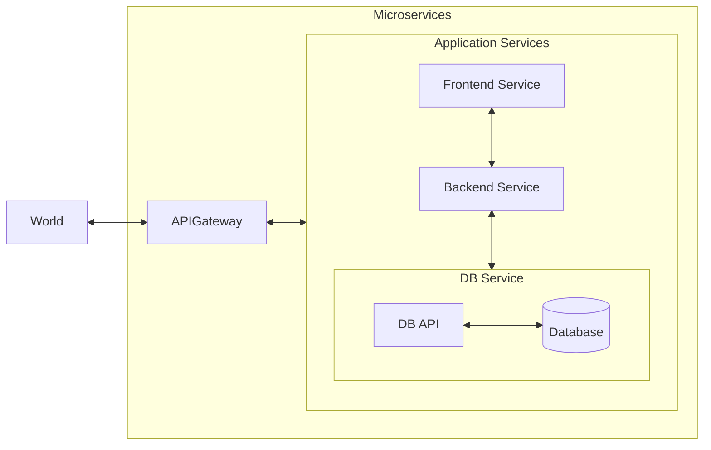

# The Spring Boot Microservices Project

## Architecture



## Repo Tree

```plaintext
├── .github
│   ├── dependabot.yml
│   └── workflows
│       └── maven.yml
├── .gitignore
├── .vscode
│   └── settings.json
├── README.md
├── backend
│   ├── .vscode
│   │   ├── launch.json
│   │   └── settings.json
│   ├── pom.xml
│   └── src
│       ├── main
│       │   ├── java
│       │   │   └── io
│       │   │       └── d4rkr0n1n
│       │   │           └── sample
│       │   │               ├── NotesBackendApplication.java
│       │   │               ├── controller
│       │   │               │   └── NotesRestController.java
│       │   │               ├── helper
│       │   │               │   └── ResponseHelper.java
│       │   │               ├── model
│       │   │               │   └── Note.java
│       │   │               ├── repository
│       │   │               │   └── NotesRepository.java
│       │   │               ├── service
│       │   │               │   ├── NotesResponseService.java
│       │   │               │   └── NotesService.java
│       │   │               └── utils
│       │   │                   └── TimeUtils.java
│       │   └── resources
│       │       ├── application.yml
│       │       └── postman
│       │           └── The Spring Boot Microservices Project.postman_collection.json
│       └── test
│           └── java
│               └── io
│                   └── d4rkr0n1n
│                       └── sample
│                           └── SampleApplicationTests.java
└── frontend
    ├── .vscode
    │   ├── launch.json
    │   └── settings.json
    ├── pom.xml
    └── src
        ├── main
        │   ├── java
        │   │   └── io
        │   │       └── d4rkr0n1n
        │   │           └── sample
        │   │               ├── NotesFrontendApplication.java
        │   │               ├── clients
        │   │               │   └── BackendClient.java
        │   │               ├── controller
        │   │               │   └── NotesViewController.java
        │   │               └── model
        │   │                   └── Note.java
        │   └── resources
        │       ├── application.yml
        │       ├── postman
        │       │   └── The Spring Boot Microservices Project.postman_collection.json
        │       ├── static
        │       │   ├── css
        │       │   │   └── styles.css
        │       │   └── js
        │       │       └── script.js
        │       └── templates
        │           ├── fragments
        │           │   └── notesList.html
        │           └── index.html
        └── test
            └── java
                └── io
                    └── d4rkr0n1n
                        └── sample
                            └── SampleApplicationTests.java

```

> Generated by [RepoTree](https://ascii-repotree.vercel.app/)
