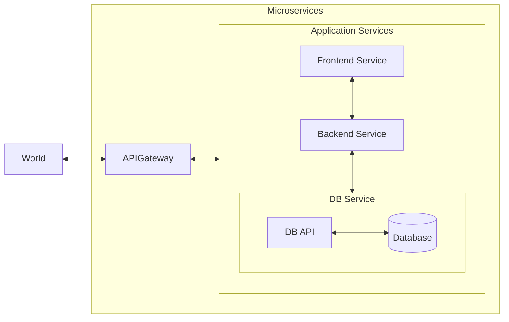

# The Spring Boot Microservices Project

## Architecture

### Done

- [x] Simple Hello World API
- [x] Add GitHub Actions for build and test
- [x] Add Architecture diagram
- [x] Skeleton CRUD API
- [x] Spring JPA Data
- [x] CRUD API
- [x] Business Logic Service
- [x] Add ResponseEntity
- [x] Add Postman API Collection
- [x] Refactor PutMapping Function
- [x] Refactor Service Class
- [x] Response Entity Refactoring
- [x] Thymeleaf Frontened: Initial Setup
- [x] Thymeleaf Frontened: Create
- [x] Thymeleaf Frontened: Delete
- [x] Thymeleaf Frontened: Update
- [x] Refactor HTML templates
- [x] Change naming conventions
- [x] Separate folder for frontend to be created

### Work in Progress

- [ ] Separate folder for backend to be created

## Future Plans

### Prerequisites

- [ ] Improve Architecture Diagram
- [ ] Spring Data Rest for DB
- [ ] Add API Gateway
- [ ] Add Frontend Microservice

### Dockerizing the application

- [ ] Create dockerfile for each service
- [ ] Create docker compose for microservices stack
