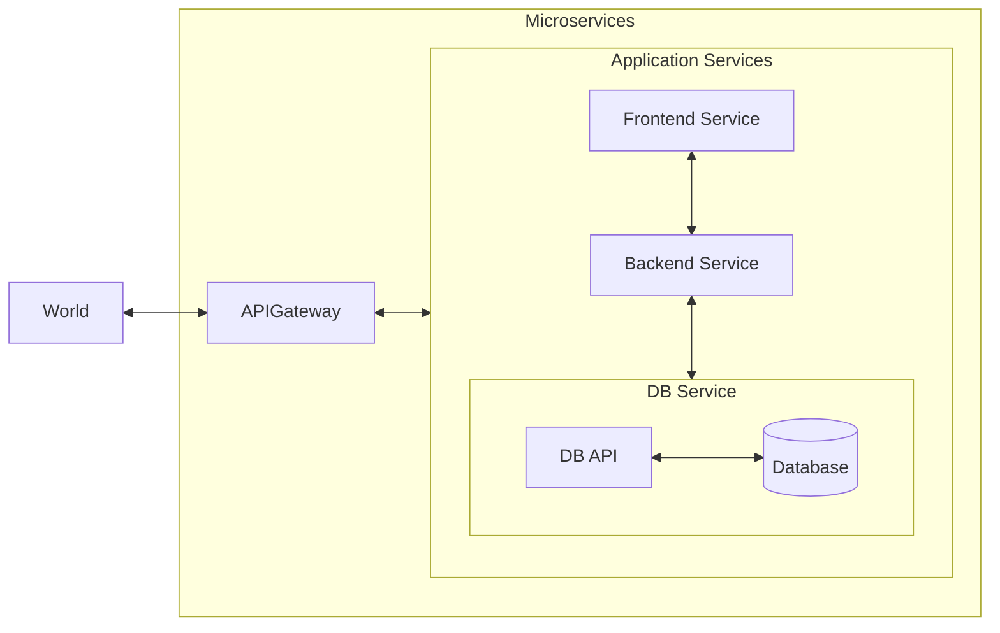

# The Spring Boot Microservices Project

## Architecture

## Creating Microservices Skeleton
- [x] Simple Hello World API - 15/10/2024
- [x] Add GitHub Actions for build and test - 15/10/2024
- [x] Add Architecture diagram
- [x] Skeleton CRUD API
- [ ] CRUD API + Spring JPA Data
- [ ] Improve Architecture Diagram
- [ ] Spring Data Rest for DB
- [ ] Add API Gateway
- [ ] Add Frontend Microservice

## Dockerizing the application
- [ ] Create dockerfile for each service
- [ ] Create docker compose for microservices stack
