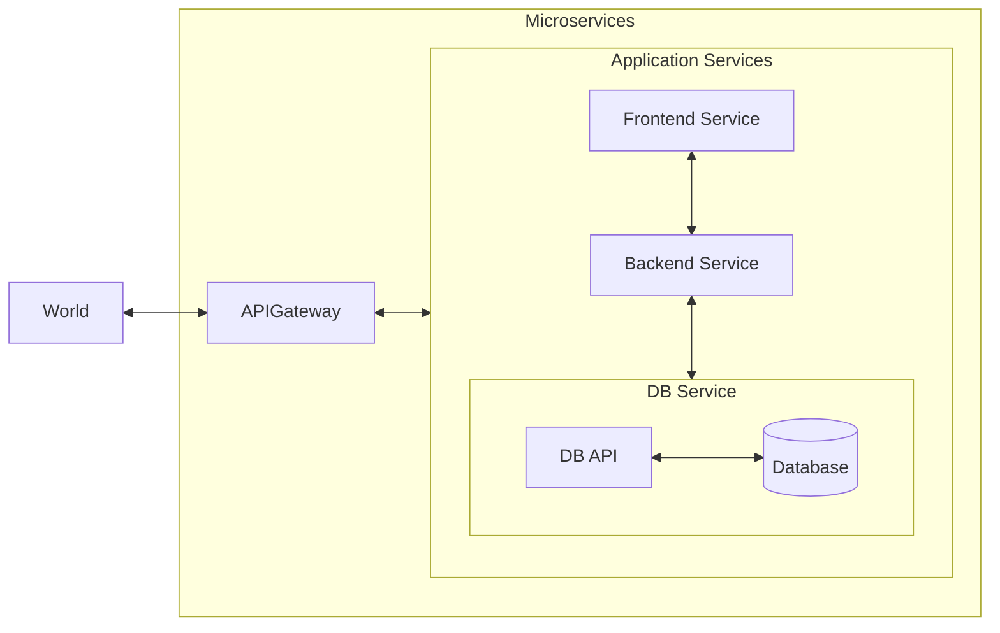

# The Spring Boot Microservices Project

## Architecture

## Creating Microservices Skeleton
- [x] Simple Hello World API - 15/Oct/2024
- [x] Add GitHub Actions for build and test - 15/Oct/2024
- [x] Add Architecture diagram - 16/Oct/2024
- [x] Skeleton CRUD API - 17/Oct/2024
- [x] Spring JPA Data - 18/Oct/2024
- [x] CRUD API | Part 1 - 19/Oct/2024
- [x] CRUD API | Part 2: Updated delete method CRUD function - 20/Oct/2024
- [x] CRUD API | Part 3: Updated put method CRUD function - 21/Oct/2024
- [x] Business Logic Service | Part 1 - 22/10/2024
- [x] Business Logic Service | Part 2 - 23/10/2024
- [ ] Improve Architecture Diagram
- [ ] Spring Data Rest for DB
- [ ] Add API Gateway
- [ ] Add Frontend Microservice

## Dockerizing the application
- [ ] Create dockerfile for each service
- [ ] Create docker compose for microservices stack
